# APP FLOW DOCUMENT
## Geo-Contextual App — Alur Aplikasi & Information Architecture

> Dokumen ini melengkapi PRD_Geo-Contextual-App.md. Diagram menggunakan format **Mermaid** — dapat dirender langsung di Obsidian, GitHub, VS Code (extension Mermaid), atau di mermaid.live bila viewer Anda belum mendukung mermaid secara native.

---

## 1. Sitemap / Information Architecture

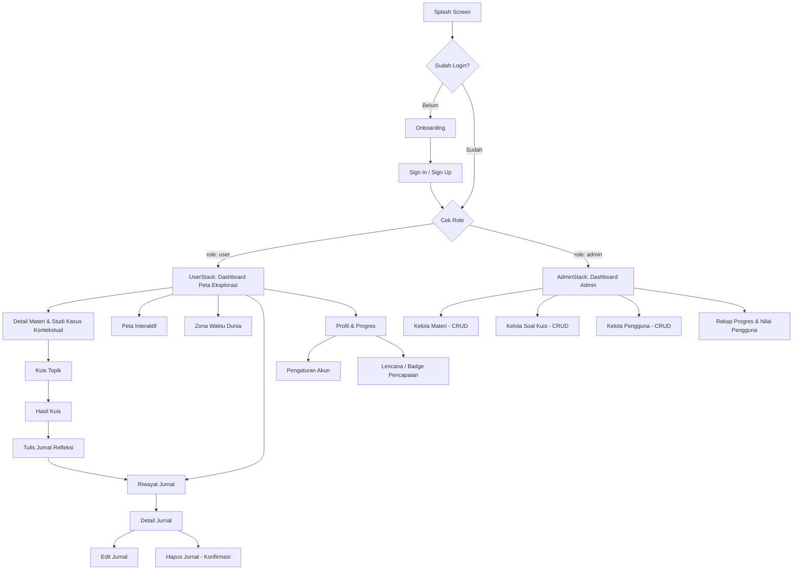

> **Catatan arsitektur:** `UserStack` dan `AdminStack` berada dalam **satu aplikasi React Native** yang sama. Setelah Sign In berhasil, sistem membaca field `role` pada akun untuk menentukan stack navigasi mana yang ditampilkan (lihat PRD bagian 10.1).

---

## 2. Flow Detail: Onboarding & Autentikasi

**Tujuan:** Memperkenalkan konsep "menjelajah Geografi" dan memastikan siswa masuk dengan identitas yang terhubung ke kelasnya.

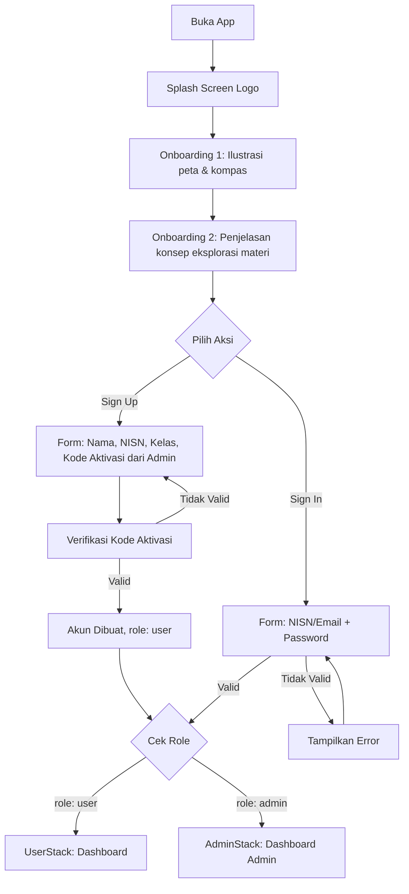

**Referensi layar (dari desain acuan):** layar "Sign In / Sign Up" dengan tombol outline mustard di atas latar ilustrasi gurun → diadaptasi menjadi ilustrasi **peta dunia/kompas geografi** dengan palet teal-sand yang sama. Form Sign Up sama untuk User; Admin dibuatkan akunnya langsung melalui database/seed awal (tidak ada Sign Up publik untuk role Admin, demi keamanan).

---

## 3. Flow Detail: Dashboard "Peta Eksplorasi" (Learning Path)

**Tujuan:** Menggantikan daftar materi konvensional dengan **jalur eksplorasi visual** (mengadopsi pola "maze/path map" pada referensi), memberi gamifikasi progres belajar per minggu/topik.

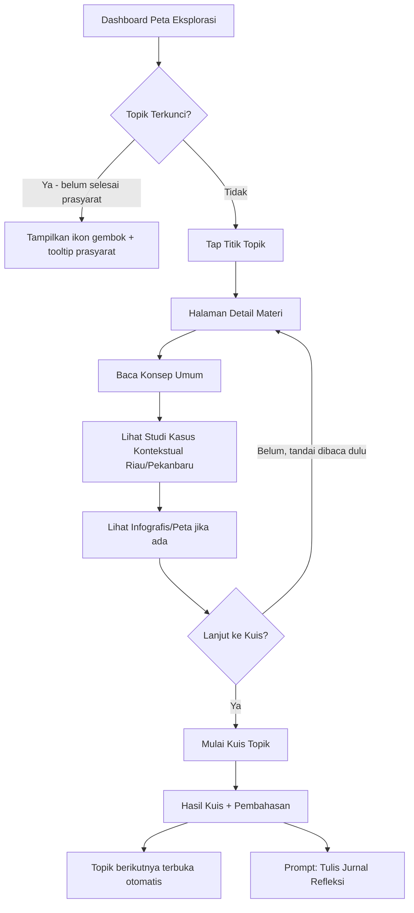

**Status visual tiap titik topik:** `Terkunci` (abu-abu) → `Tersedia` (mustard outline) → `Sedang Dikerjakan` (teal terisi sebagian) → `Selesai` (teal penuh + centang/bintang), meniru indikator "1 Day", checkpoint bendera, dan ikon hewan/landmark pada jalur referensi.

---

## 4. Flow Detail: Peta Interaktif & Zona Waktu Dunia

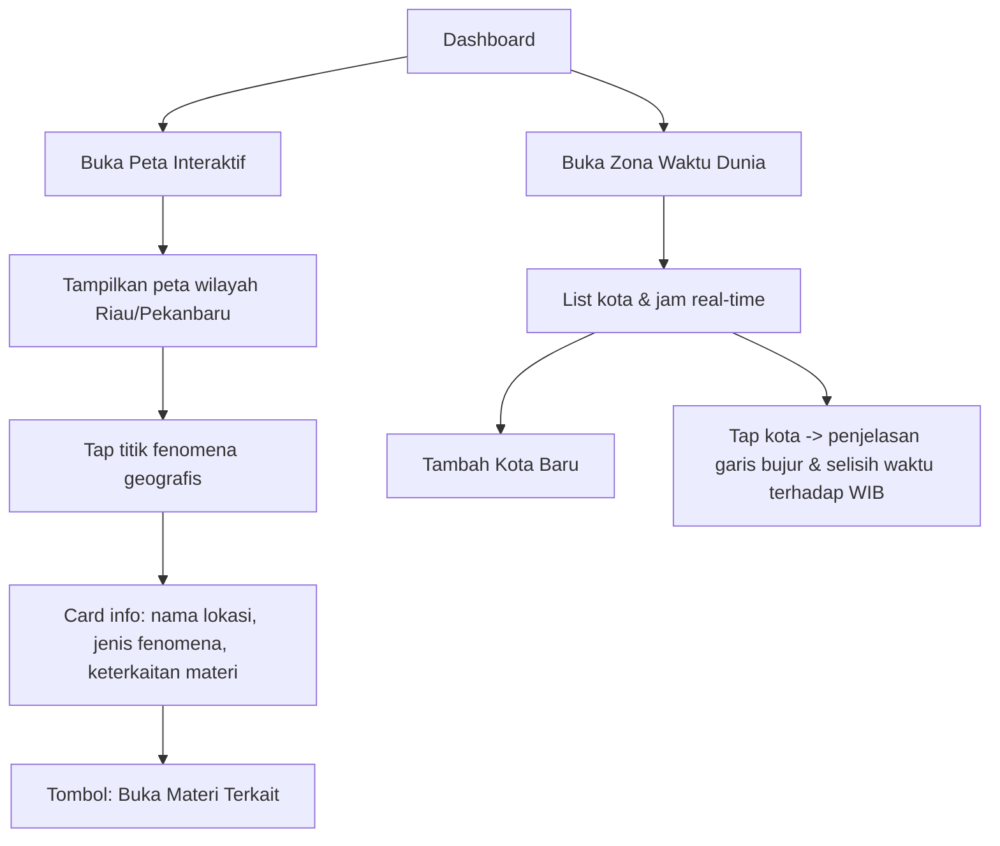

**Referensi layar:** menggantikan layar *"Clock / World Time (Beijing, Guatemala, Hong Kong)"* pada desain acuan — fungsinya dipertahankan namun konten diarahkan ke pembelajaran **garis bujur dan pembagian zona waktu**.

---

## 5. Flow Detail: Kuis & Evaluasi

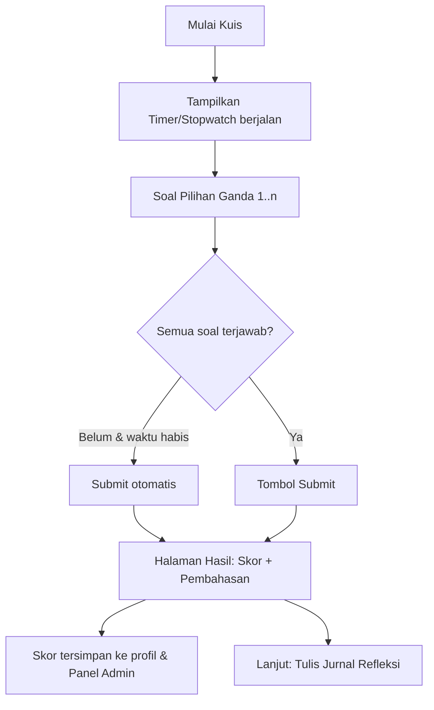

---

## 6. Flow Detail: Jurnal Refleksi Belajar ("My Diary")

**Tujuan:** Mengadaptasi langsung fitur *Mood Diary* pada referensi — siswa merefleksikan pengalaman belajarnya (prinsip *reflecting* dalam Contextual Teaching and Learning).

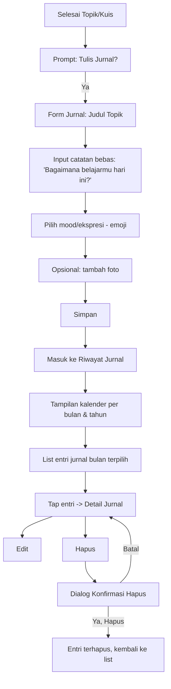

**Referensi layar yang diadaptasi 1:1:**
- *"My diary"* (list per bulan, tab tahun 2020–2024+) → **Riwayat Jurnal**, tab diganti per **semester/bulan tahun ajaran**.
- *"Enter the topic / How is today?"* (form catatan kosong dengan ilustrasi) → **Form Jurnal Refleksi**.
- *"Delete item"* (list dengan checkmark hijau, tombol silang merah) → **Konfirmasi Hapus Jurnal**, gaya & komponen dipertahankan sama.

---

## 7. Flow Detail: Profil & Progres (Halaman User)

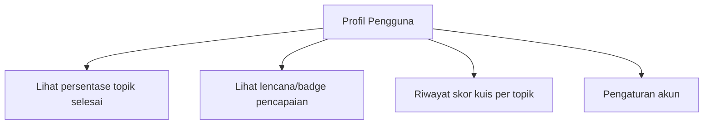

---

## 8. Flow Detail: Panel Admin (CRUD)

**Tujuan:** Memberi Admin kendali penuh atas konten & data pengguna, terpisah dari pengalaman belajar User, dalam satu aplikasi React Native yang sama (akses via `AdminStack`).

### 8.1 Dashboard Admin

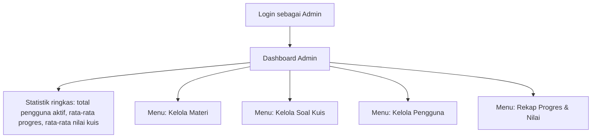

### 8.2 CRUD Kelola Materi

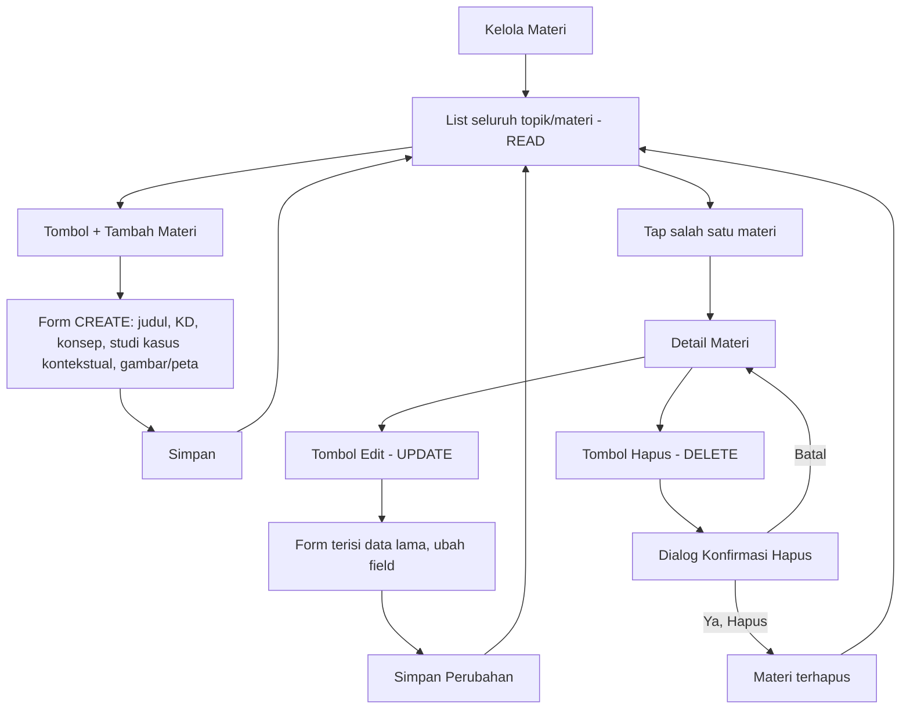

### 8.3 CRUD Kelola Soal Kuis

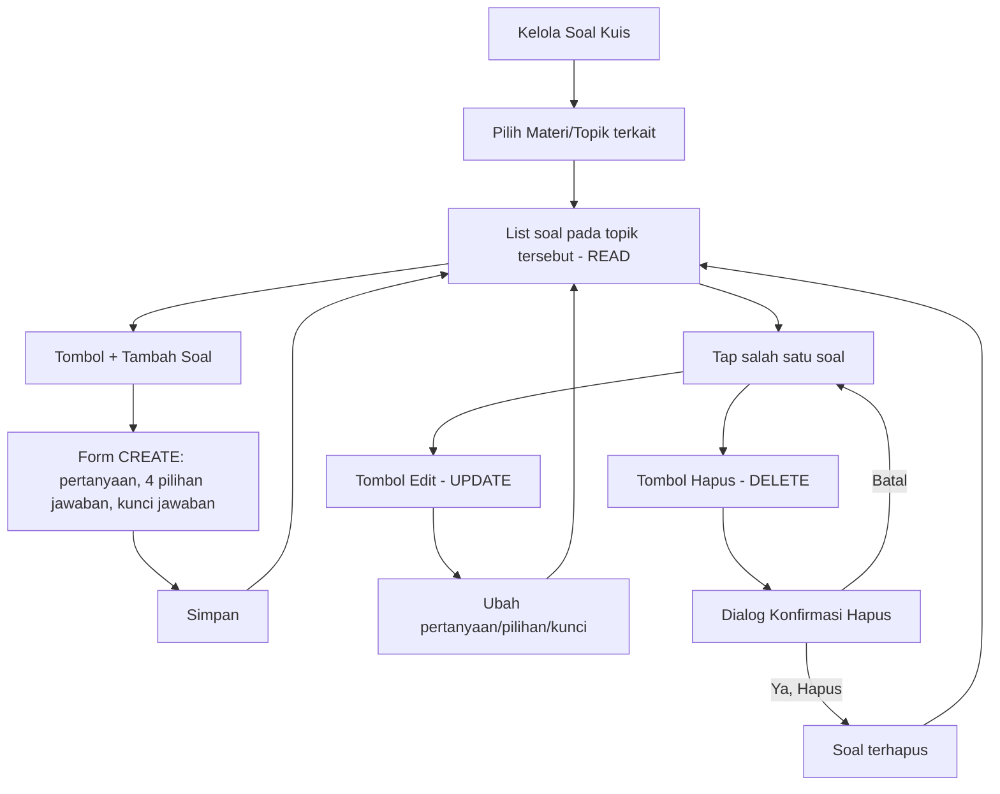

### 8.4 CRUD Kelola Pengguna

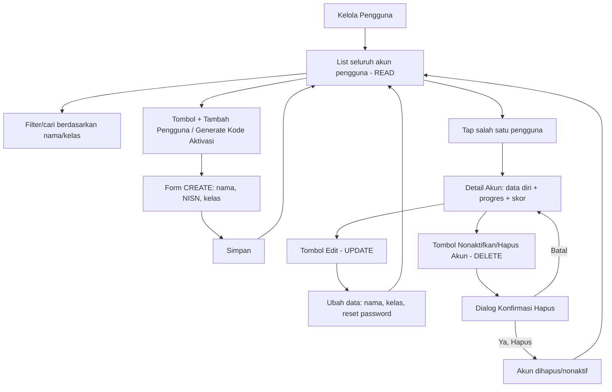

> **Privasi:** Detail Akun pada Admin **tidak menampilkan isi jurnal refleksi pribadi** pengguna — hanya data progres & skor kuis (agregat), sesuai FR-29 pada PRD.

### 8.5 Rekap Progres & Nilai

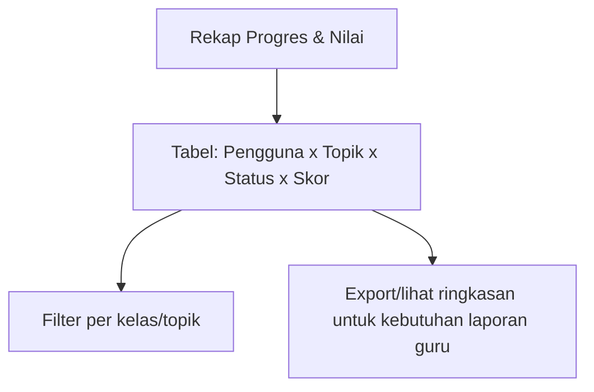

**Catatan desain Panel Admin:** komponen visual (kartu list, tombol, dialog konfirmasi hapus) tetap mengikuti Design System yang sama dengan halaman User (lihat Design.md) — hanya struktur layar yang lebih berorientasi tabel/form data, mengingat ini adalah panel pengelolaan, bukan pengalaman eksplorasi.

---

## 9. Ringkasan Navigasi Utama (Bottom Navigation Bar)

### 9.1 Bottom Nav — Halaman User

Mengacu pola bottom-nav 5 ikon pada referensi (chat/jurnal, dokumen, peta/kamera, lokasi, profil), disesuaikan menjadi:

| Posisi | Ikon | Tujuan |
|---|---|---|
| 1 | 🗺️ Peta Eksplorasi | Dashboard utama / learning path |
| 2 | 📖 Materi | Daftar semua modul (akses cepat tanpa harus lewat jalur) |
| 3 | 📍 Peta Interaktif | Peta fenomena geografis kontekstual |
| 4 | 📔 Jurnal | Riwayat jurnal refleksi |
| 5 | 👤 Profil | Progres, badge, pengaturan |

Tombol **(+)** mengambang (floating action button) di layar Jurnal untuk menambah entri baru — dipertahankan persis seperti pada referensi.

### 9.2 Bottom Nav — Halaman Admin

| Posisi | Ikon | Tujuan |
|---|---|---|
| 1 | 📊 Dashboard | Statistik ringkas |
| 2 | 📚 Materi | Kelola Materi (CRUD) |
| 3 | 📝 Soal | Kelola Soal Kuis (CRUD) |
| 4 | 👥 Pengguna | Kelola Pengguna (CRUD) |
| 5 | ⚙️ Akun | Profil Admin & logout |

Tombol **(+)** mengambang juga dipertahankan pada layar Kelola Materi/Soal/Pengguna sebagai aksi cepat **Create**, konsisten dengan pola FAB di halaman User.

---

## 10. Aturan Navigasi & State Penting

- **Maksimal 3 tap** dari Dashboard ke fitur manapun, baik di UserStack maupun AdminStack.
- Topik terkunci tidak dapat ditekan untuk masuk ke materi (hanya menampilkan tooltip prasyarat).
- Jurnal yang sudah dihapus **tidak dapat di-undo** dari sisi UI — karena itu konfirmasi hapus wajib ditampilkan (selaras referensi layar "Delete item"). Aturan ini berlaku juga untuk semua aksi Delete di Panel Admin (materi, soal, pengguna).
- Mode offline (UserStack): ikon indikator kecil di header saat tidak ada koneksi; entri jurnal & progres kuis disimpan lokal lalu disinkronkan otomatis saat online kembali.
- **Role Admin tidak memiliki akses** untuk membaca isi jurnal refleksi pribadi pengguna (hanya data agregat/statistik progres & nilai), untuk menjaga privasi siswa.
- **Route Guard:** User tidak dapat mengakses layar AdminStack meski mencoba deep-link manual; sebaliknya Admin tidak memiliki akun Sign Up publik.

---

*Lihat Design_Geo-Contextual-App.md untuk spesifikasi visual (warna, tipografi, komponen) dari setiap layar di atas.*
